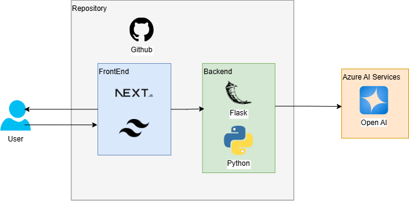

# GIPlan
## Planograma visual, auditivo, fácil de implementar


## Descripción general

GIPlan es una herramienta innovadora diseñada para facilitar la correcta implementación de planogramas en tiendas de autoservicio. A diferencia de los planogramas tradicionales que solo muestran imágenes estáticas, GIPlan presenta una animación del acomodo de productos acompañada de instrucciones de audio, haciendo que el proceso de organización sea más intuitivo, accesible y menos propenso a errores.

Gracias al uso de servicios de inteligencia artificial de Azure, como Azure OpenAI, GIPlan transforma nombres de productos en instrucciones de voz claras y comprensibles, reduciendo ambigüedades y mejorando la eficiencia del personal encargado del acomodo.

## Características clave

* **Planograma animado**: Visualización dinámica que muestra cómo deben colocarse los productos paso a paso.
* **Instrucciones de audio**: Guía auditiva sincronizada con la animación para facilitar el proceso de implementación.
* **Preprocesamiento inteligente**: Uso de modelos de lenguaje (Azure OpenAI) para limpiar y estructurar nombres de productos.
* **Interfaz moderna**: Aplicación web construida con Next.js y Tailwind CSS.
* **Backend robusto**: Gestión de lógica y rutas API usando Python y Flask.

### Solución a las problemáticas

| **Problemática**                                                | **Solución**                                                |
| --------------------------------------------------------------- | ----------------------------------------------------------- |
| Desalineación entre planograma teórico y acomodo real           | Animación visual paso a paso                                |
| Confusión en los nombres de productos                          | Preprocesamiento con Azure OpenAI para instrucciones claras |
| Dificultad de implementación para personas con poca experiencia o capacidades difernetes | Instrucciones auditivas fáciles de seguir junto con una animación visual                |
| Soluciones de difícil implementación en proyectos disruptivos                          | GIPlan es de fácil implementación, pues trabaja apartir de archivos csv, los cuáles son fáciles de modificar |

## Arquitectura / Tech Stack

GIPlan combina herramientas modernas de desarrollo web y servicios de inteligencia artificial:



* **Frontend**: Next.js + Tailwind CSS
* **Backend**: Flask + Python
* **Servicios en la nube**: Azure OpenAI (para normalización y generación de instrucciones de texto)

## Componentes principales

### Animación

Muestra visualmente cómo deben colocarse los productos en cada estante de forma secuencial, permitiendo una implementación más intuitiva y precisa.

### Instrucciones de audio

Convierte descripciones complejas de productos en frases claras y comprensibles mediante preprocesamiento con Azure OpenAI, para luego transformarlas en audio.

### Reporte de distribución

Genera reportes dónde se puede comparar de forma rápida e intuitiva la distribución de los productos.

## Principios de IA Responsable
Como equipo consideramos que es fundamental implementar soluciones de Inteligencia Artificial que estén alineadadas con los principios éticos de la Inteligencia Artificial para procurar un beneficio general

| **Principio**        | **Aplicación en GIPlan**                                                                                                          |
| -------------------- | --------------------------------------------------------------------------------------------------------------------------------- |
| Equidad              | Las instrucciones se generan objetivamente a partir de reglas claras de preprocesamiento.                                         |
| Inclusión            | El sistema auditivo permite que personas con distintos niveles de alfabetización o habilidades visuales participen en el acomodo. |
| Fiabilidad           | Las instrucciones son generadas a partir de modelos consistentes, reduciendo el riesgo de ambigüedad en los nombres de productos. |
| Transparencia        | Las transformaciones aplicadas a los nombres de productos pueden ser verificadas por el usuario antes de ser convertidas a audio. |
| Privacidad           | No se utiliza información personal ni sensible en el proceso de normalización o generación de instrucciones.                      |
| Rendición de cuentas | El acomodo final sigue siendo verificado por un humano responsable, aunque el sistema asista en la automatización del proceso.    |

## Estructura del proyecto

```
GIPlan/
├── README.md
├── assets/                   # Assets for documentation
│   ├── GIPLANPortada.png
│   ├── ArquitecturaGIPlan.png
│   └── PresentacionGIPlanFEMSAHackathon.pdf
├── frontend/                 # Next.js frontend application
│   ├── .gitignore
│   ├── next.config.js
│   ├── package.json
│   ├── postcss.config.mjs
│   ├── tsconfig.json
│   ├── public/
│   │   ├── Oxxo_Logo.svg
│   │   ├── planograma_layout.json
│   │   ├── Planogramas/
│   │   │   ├── Estante_1.png
│   │   │   ├── Estante_2.png
│   │   │   ├── goodtexture.jpg
│   │   │   └── plastic.jpg
│   │   └── Product_images/
│   │       └── [Archivos de imágenes]
│   └── src/
│       └── app/
│           ├── favicon.ico
│           ├── globals.css
│           ├── layout.tsx
│           └── page.tsx
└── backend/                  # Flask backend services
    ├── requirements.txt
    ├── app.py                # Main Flask application
    ├── services/             # Backend service modules
    │   └── product_processor.py
    ├── data/                 # Data files
    │   └── Planograma_bueno.csv
    └── notebooks/
        └── Generar_Estante_Bien.ipynb
```
## Costos: 
Para el preprocesamiento de los nombres se utiliza el servicio de azure Open AI. El modelo utilizado GPT 3.5-Turbo tiene un costo de $0.0020 por 1,000 tokens. Por la forma en la que está diseñada la solución, solo se debe de utilizar una vez este servicio para generar los nombres adecuados y posteriormente se exporta a un csv, ahorrando llamadas innecesarias o repetitivas al servicio, Pues para cada planograma nuevo solo se deben de preprocesar una vez los nombres de los productos.
Para este escenario, el preprocesamiento de los 48 productos consumió un total de 6.73k tokens, lo que se traduce a un costo mensual de $0.01 dólares.

## Installation and Setup

Sigue estos pasos para ejecutar GIPlan en tu entorno local:

### Prerrequisitos

- [Python](https://www.python.org/downloads/) (v3.8 o superior)
- [Node.js](https://nodejs.org/) (v18 o superior)
- [npm](https://www.npmjs.com/) o [yarn](https://yarnpkg.com/)
- Cuenta de Azure con acceso a Azure OpenAI Service

### Configuración del Backend
xd
1. Asegurate de que tu directorio apunte a la carpeta de "OXXO"

2. Crea y activa un entorno virtual en terminal (opcional pero recomendado):
   ```bash
   # Para Windows
   python -m venv venv
   venv\Scripts\activate
   ```

3. Instala las dependencias:
   ```bash
   pip install -r requirements.txt
   ```

4. Inicia el servidor para el audio que se usará para la página:
   ```bash
   python audio.py
   ```
   La API estará disponible para usarse en `http://localhost:3000`.

5. Asegurarse de tener instalado node:
   ```bash
   npm install
   # o
   yarn install
   ```

6. Ejecuta el script que permitirá disponer de la página web localmente:
   ```bash
   npm run dev
   ```
   La aplicación frontend se ejecutará en `http://localhost:3000`.

### Acceso a la aplicación

Una vez que ambos servidores estén en ejecución, puedes acceder a GIPlan abriendo tu navegador y visitando:

```
http://localhost:3000
```

## Futuros pasos

* **Transcripción de voz**: Convertir instrucciones habladas de los supervisores en nuevos planogramas automáticamente.
* **Aplicación móvil**: Para facilitar el acomodo en campo.
* **Análisis avanzado**: Métricas de eficiencia en la implementación de planogramas.
* **Entrenamiento del personal**: Módulo interactivo de aprendizaje usando IA.
* **Modo sin conexión**: Para tiendas sin conexión estable a internet.
* **Optimización del preprocesamiento de datos**: Para tiendas con un volumen considerablemente mayor de productos.
